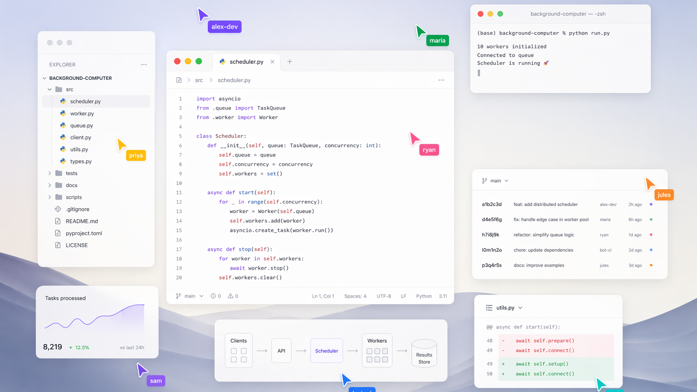

# BackgroundComputerUse

Local macOS computer-use API for controlling native apps, browser windows, and multi-window desktop workflows without taking over the user's pointer.

The runtime exposes a loopback HTTP API, reads window screenshots and Accessibility state, and dispatches clicks, scrolling, text, key presses, secondary actions, and window motion against target windows. It uses macOS Accessibility, Screen Recording, and native/private window-event APIs.

At rough parity with OpenAI Codex Computer Use plugin 

[](https://youtu.be/RmB5Ontqb3Y)

[Watch the demo](https://youtu.be/RmB5Ontqb3Y)

## Start

```bash
./script/start.sh
```

The script builds the Swift package, creates/signs a `.app` bundle, installs it to `~/Applications/BackgroundComputerUse.app`, launches it, waits for the runtime manifest, prints the active local URL, and calls `/v1/bootstrap`.

Runtime metadata is written to:

```text
$TMPDIR/background-computer-use/runtime-manifest.json
```

The manifest includes `baseURL`, permission status, bootstrap instructions, and route summaries. Agents should read this file instead of assuming a fixed port.

## Signing And Permissions

Since the app requires accessibility + screenshot permissions, you need to sign (self-sign ok) the app after building 

macOS permissions attach to the signed app bundle, not to an arbitrary command-line binary. Launch development builds through:

```bash
./script/start.sh
```

or:

```bash
./script/build_and_run.sh run
```

If no signing identity is configured, `script/build_and_run.sh` calls `script/bootstrap_signing_identity.sh` to create a local development code-signing identity in:

```text
~/Library/Keychains/background-computer-use-dev.keychain-db
```

You can override signing with:

```bash
BACKGROUND_COMPUTER_USE_SIGNING_IDENTITY="Developer ID Application: ..."
./script/start.sh
```

If `/v1/bootstrap` reports missing permissions, grant them in System Settings and relaunch the app through the script.

## Swift Package Usage

The package also exposes a direct Swift API for callers that do not need the loopback server:

Depend on the `BackgroundComputerUseKit` library product, then import the `BackgroundComputerUse` module:

```swift
import BackgroundComputerUse

let runtime = BackgroundComputerUseRuntime()
let apps = runtime.listApps()
let windows = try runtime.listWindows(.init(app: "Safari"))
```

Direct package calls default to `visualCursor: .disabled`, so action methods do not start the virtual cursor overlay or wait for cursor animation before dispatching. Existing action verification and post-action rereads still run.

Target factories validate the same shape as the HTTP JSON decoder and throw for invalid display indexes or empty node identifiers.

Enable the visual cursor explicitly when you want the same cursor choreography used by the app runtime:

```swift
let runtime = BackgroundComputerUseRuntime(
    options: .init(visualCursor: .enabled)
)
```

macOS permissions attach to the signed host application. The bundled HTTP runtime keeps using the stable `xyz.dubdub.backgroundcomputeruse` app identity from `script/build_and_run.sh`; direct package consumers should use their own stable signed app identity if they need Accessibility or Screen Recording permissions.

## API Flow

1. `GET /v1/bootstrap`
2. Check `permissions` and `instructions.ready`.
3. `GET /v1/routes`
4. `POST /v1/list_apps`
5. `POST /v1/list_windows`
6. `POST /v1/get_window_state`
7. Act with `/v1/click`, `/v1/scroll`, `/v1/type_text`, `/v1/press_key`, `/v1/set_value`, `/v1/perform_secondary_action`, `/v1/drag`, `/v1/resize`, or `/v1/set_window_frame`.
8. Read state again.

For visual work, request screenshots with `imageMode: "path"` or `imageMode: "base64"` and inspect them whenever possible. The AX tree is useful for semantic targeting, but screenshots are the visual ground truth; AX state and verifier summaries can lag, omit visual-only state, or be incomplete in some apps.

## Routes

`GET /v1/routes` is the self-documenting API catalog. It returns each route's method, path, summary, request schema, and response schema.

Action responses omit verbose implementation `notes` by default. Add `"debug": true` to action requests when you want transport/planner notes for debugging.

Core routes:

- `GET /health`
- `GET /v1/bootstrap`
- `GET /v1/routes`
- `POST /v1/list_apps`
- `POST /v1/list_windows`
- `POST /v1/get_window_state`
- `POST /v1/click`
- `POST /v1/scroll`
- `POST /v1/perform_secondary_action`
- `POST /v1/drag`
- `POST /v1/resize`
- `POST /v1/set_window_frame`
- `POST /v1/type_text`
- `POST /v1/press_key`
- `POST /v1/set_value`

## Minimal Curl

```bash
BASE="$(python3 - <<'PY'
import json, os
path = os.path.join(os.environ["TMPDIR"], "background-computer-use", "runtime-manifest.json")
print(json.load(open(path))["baseURL"])
PY
)"

curl -s "$BASE/v1/bootstrap" | python3 -m json.tool
curl -s "$BASE/v1/routes" | python3 -m json.tool
curl -s -X POST "$BASE/v1/list_apps" -H 'content-type: application/json' -d '{}' | python3 -m json.tool
```

## State And Actions

Read a window:

```bash
curl -s -X POST "$BASE/v1/list_windows" \
  -H 'content-type: application/json' \
  -d '{"app":"Safari"}' | python3 -m json.tool

curl -s -X POST "$BASE/v1/get_window_state" \
  -H 'content-type: application/json' \
  -d '{"window":"WINDOW_ID","imageMode":"path","maxNodes":6500}' | python3 -m json.tool
```

Click by semantic target:

```bash
curl -s -X POST "$BASE/v1/click" \
  -H 'content-type: application/json' \
  -d '{"window":"WINDOW_ID","target":{"kind":"display_index","value":12},"clickCount":1,"imageMode":"path"}' | python3 -m json.tool
```

Click by screenshot coordinate:

```bash
curl -s -X POST "$BASE/v1/click" \
  -H 'content-type: application/json' \
  -d '{"window":"WINDOW_ID","x":240,"y":180,"clickCount":2,"imageMode":"path"}' | python3 -m json.tool
```

Type into a text target:

```bash
curl -s -X POST "$BASE/v1/type_text" \
  -H 'content-type: application/json' \
  -d '{"window":"WINDOW_ID","target":{"kind":"display_index","value":4},"text":"hello","focusAssistMode":"focus_and_caret_end","imageMode":"path"}' | python3 -m json.tool
```

Use the optional `cursor` object on action routes to show an on-screen agent cursor:

```json
{"id":"agent-1","name":"Agent","color":"#20C46B"}
```

Cursors are session-based. Reuse the same `cursor.id` across related actions to move the same on-screen cursor continuously; use different IDs for independent agents or lanes.

## License

MIT

---

crafted by [cam](https://x.com/financialvice) and [anupam](https://x.com/anupambatra_) | [dubdubdub labs](https://www.dubdubdub.xyz/)
