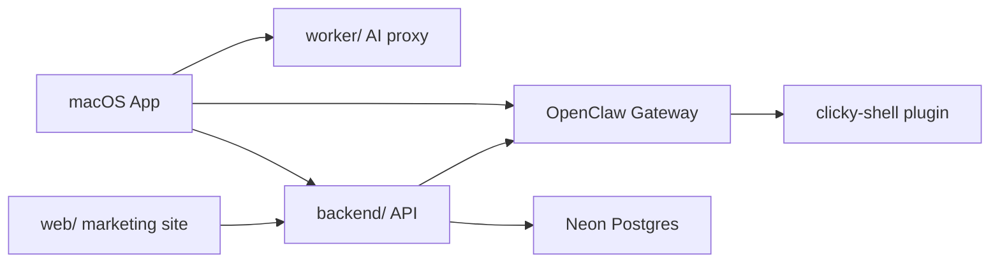
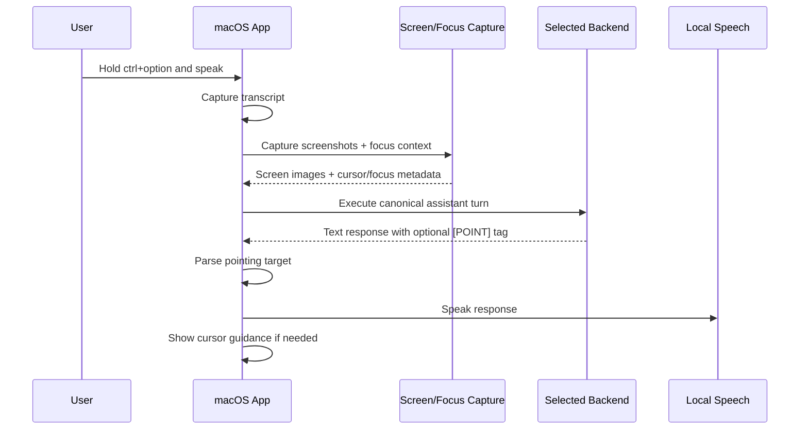
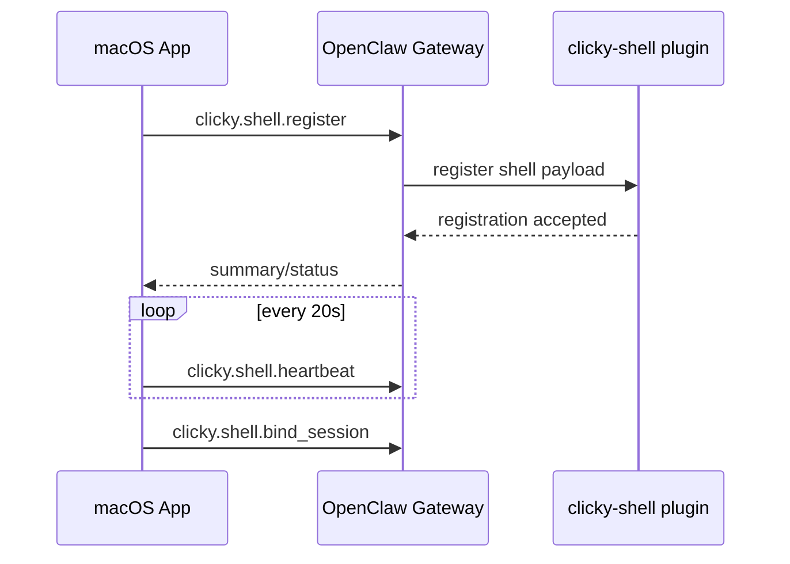
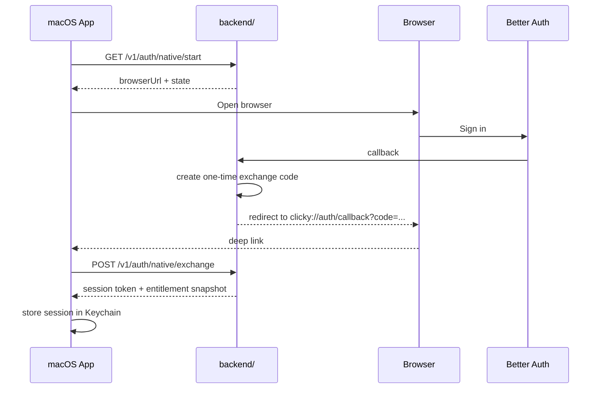
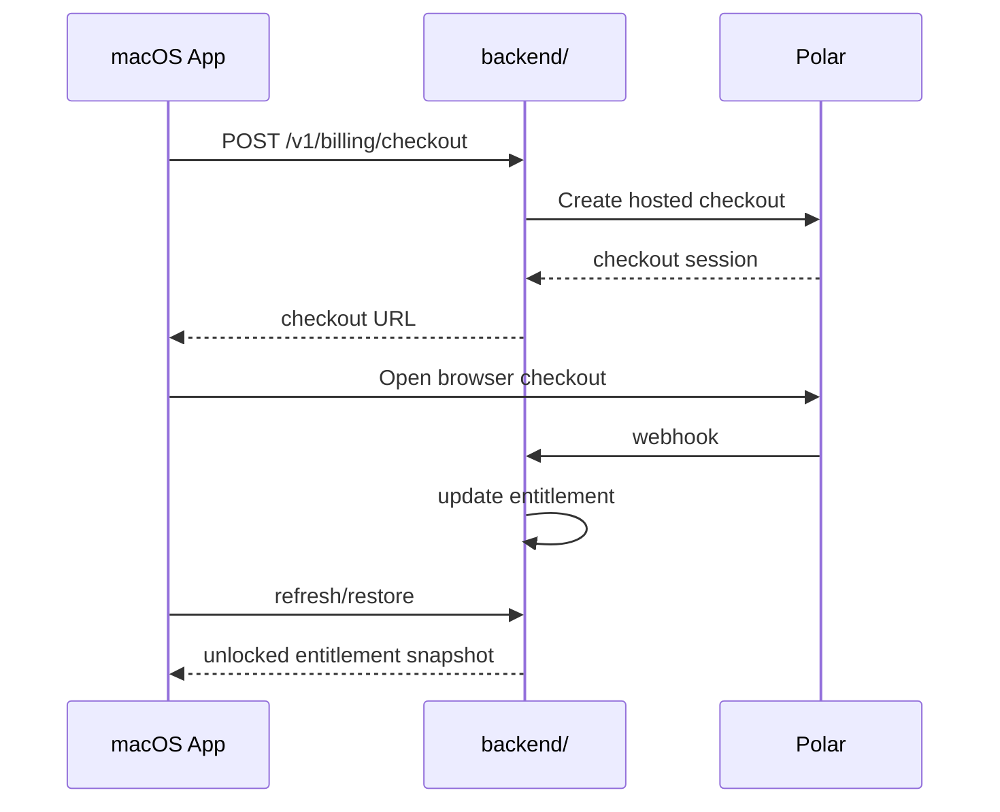
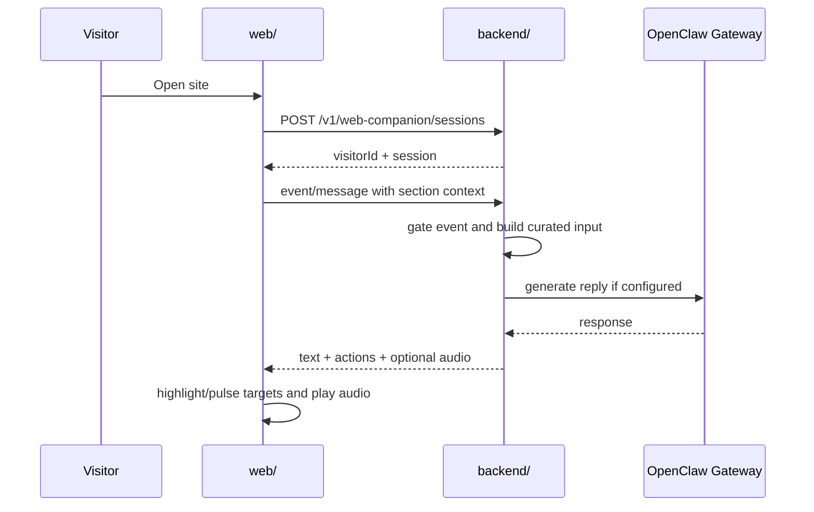
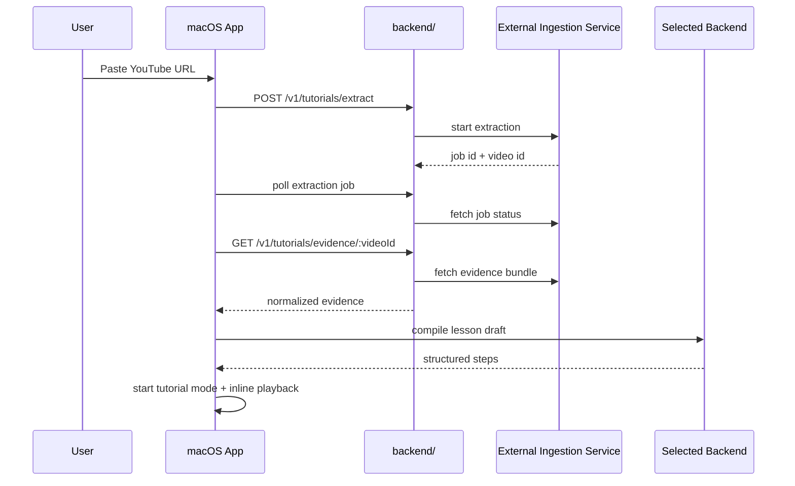

# Clicky Architecture

This document is the implementation-grounded architecture reference for the
current Clicky repository.

It is meant to answer:

- what the main deployable pieces are
- what each piece owns
- how the important user-facing flows actually work
- where current boundaries, assumptions, and risks live

This doc complements:

- [clicky-identity.md](./clicky-identity.md) for product feel and experience rules
- [macos-design.md](./macos-design.md) for desktop UI rules
- [product-vision.md](./product-vision.md) for the shell/runtime thesis
- [launch-phase-0-contracts.md](./launch-phase-0-contracts.md) for launch-platform contract details
- [clicky-openclaw-integration-contract.md](./clicky-openclaw-integration-contract.md) for the OpenClaw shell contract

## Source Of Truth Hierarchy

When docs disagree, use this order:

1. Repo `AGENTS.md` files
2. The implementation in code
3. `docs/clicky-identity.md`
4. `docs/macos-design.md`
5. This document
6. Status / planning docs under `plans/`

This file tries to reflect the code as it exists now. It is not a speculative
future-state doc.

## System Overview

Clicky is a desktop shell for AI agents with three major surfaces:

- a macOS companion app
- a backend platform for auth, billing, entitlements, website companion APIs,
  and tutorial extraction proxying
- a marketing site with an additive website companion layer

There is also a dedicated AI-provider secret proxy and an OpenClaw plugin.

High-level shape:

## Main Deployables

### 1. macOS app

Path: `leanring-buddy/`

Role:

- menu bar companion shell
- push-to-talk capture
- screen capture and focus context capture
- cursor overlay and sequential pointing driven by a structured assistant response contract with short per-target bubble text
- local speech playback
- Studio configuration UI
- tutorial import and tutorial-mode playback
- native auth handoff consumer
- local OpenClaw shell registration client

Key files:

- [leanring_buddyApp.swift](/Users/amartyasingh/Documents/projects/clicky-decocereus/leanring-buddy/leanring_buddyApp.swift)
- [CompanionManager.swift](/Users/amartyasingh/Documents/projects/clicky-decocereus/leanring-buddy/CompanionManager.swift)
- [CompanionPanelView.swift](/Users/amartyasingh/Documents/projects/clicky-decocereus/leanring-buddy/CompanionPanelView.swift)
- [CompanionStudioNextView.swift](/Users/amartyasingh/Documents/projects/clicky-decocereus/leanring-buddy/CompanionStudioNextView.swift)
- [OverlayWindow.swift](/Users/amartyasingh/Documents/projects/clicky-decocereus/leanring-buddy/OverlayWindow.swift)

### 2. AI proxy worker

Path: `worker/`

Role:

- keeps model-provider secrets out of the app binary
- proxies Claude, AssemblyAI token, and ElevenLabs-style calls used by the app

This is not the launch-platform backend.

### 3. backend API

Path: `backend/`

Role:

- Better Auth session handling
- native auth handoff creation and code exchange
- entitlement lookup and refresh
- trial credit and paywall state
- Polar checkout and restore
- Polar webhook processing
- website companion session and message APIs
- tutorial extraction proxying to an external ingestion service

Key files:

- [backend/src/index.ts](/Users/amartyasingh/Documents/projects/clicky-decocereus/backend/src/index.ts)
- [backend/src/auth/native.ts](/Users/amartyasingh/Documents/projects/clicky-decocereus/backend/src/auth/native.ts)
- [backend/src/billing/routes.ts](/Users/amartyasingh/Documents/projects/clicky-decocereus/backend/src/billing/routes.ts)
- [backend/src/trial/service.ts](/Users/amartyasingh/Documents/projects/clicky-decocereus/backend/src/trial/service.ts)
- [backend/src/web-companion/service.ts](/Users/amartyasingh/Documents/projects/clicky-decocereus/backend/src/web-companion/service.ts)
- [backend/src/tutorials/routes.ts](/Users/amartyasingh/Documents/projects/clicky-decocereus/backend/src/tutorials/routes.ts)

### 4. website + website companion

Path: `web/`

Role:

- marketing site
- additive Clicky companion layer for visitors
- browser mic capture for website voice flow
- section-aware front-end state and target registry
- companion UX over backend companion routes

Key files:

- [web/src/App.tsx](/Users/amartyasingh/Documents/projects/clicky-decocereus/web/src/App.tsx)
- [web/src/components/WebCompanionExperience.tsx](/Users/amartyasingh/Documents/projects/clicky-decocereus/web/src/components/WebCompanionExperience.tsx)
- [web/src/content/companionSections.ts](/Users/amartyasingh/Documents/projects/clicky-decocereus/web/src/content/companionSections.ts)
- [web/src/content/companionTargetRegistry.ts](/Users/amartyasingh/Documents/projects/clicky-decocereus/web/src/content/companionTargetRegistry.ts)

### 5. OpenClaw plugin

Path: `plugins/openclaw-clicky-shell/`

Role:

- gives OpenClaw an explicit concept of the Clicky shell
- stores in-memory shell registrations
- exposes Clicky-specific gateway methods
- injects Clicky shell prompt context for fresh bound sessions
- prefers tool-driven presentation selection via `clicky_present`, then mirrors the tool result as final structured JSON for the app, while keeping raw structured JSON as migration fallback

Key file:

- [plugins/openclaw-clicky-shell/index.ts](/Users/amartyasingh/Documents/projects/clicky-decocereus/plugins/openclaw-clicky-shell/index.ts)

## Shared Architectural Concepts

### Clicky is the shell, not the agent

The repo consistently tries to preserve this split:

- OpenClaw or another provider owns cognition
- Clicky owns capture, presence, voice, cursor guidance, and shell UX

### Provider-agnostic assistant turns

The macOS app no longer assembles provider-specific requests directly in the
main manager. It now uses a shared assistant turn model and per-provider
adapters.

Claude and Codex both use the shared structured JSON response contract directly
through their normal text-generation paths. OpenClaw uses the `clicky_present`
tool to choose the presentation mode, then emits the same structured JSON
envelope as its final assistant message so the Mac app consumes all three
backends through the same parser.

Important files:

- [ClickyAssistantTurn.swift](/Users/amartyasingh/Documents/projects/clicky-decocereus/leanring-buddy/ClickyAssistantTurn.swift)
- [ClickyAssistantTurnBuilder.swift](/Users/amartyasingh/Documents/projects/clicky-decocereus/leanring-buddy/ClickyAssistantTurnBuilder.swift)
- [ClickyAssistantTurnExecutor.swift](/Users/amartyasingh/Documents/projects/clicky-decocereus/leanring-buddy/ClickyAssistantTurnExecutor.swift)
- [ClaudeAssistantProvider.swift](/Users/amartyasingh/Documents/projects/clicky-decocereus/leanring-buddy/ClaudeAssistantProvider.swift)
- [CodexAssistantProvider.swift](/Users/amartyasingh/Documents/projects/clicky-decocereus/leanring-buddy/CodexAssistantProvider.swift)
- [OpenClawAssistantProvider.swift](/Users/amartyasingh/Documents/projects/clicky-decocereus/leanring-buddy/OpenClawAssistantProvider.swift)

### Focus context is first-class

Every assistant turn can carry:

- screenshots
- active display
- cursor position
- recent cursor trail
- frontmost app and window
- best-effort accessibility focus metadata

Important files:

- [ClickyAssistantFocusContext.swift](/Users/amartyasingh/Documents/projects/clicky-decocereus/leanring-buddy/ClickyAssistantFocusContext.swift)
- [ClickyAssistantFocusContextProvider.swift](/Users/amartyasingh/Documents/projects/clicky-decocereus/leanring-buddy/ClickyAssistantFocusContextProvider.swift)
- [ClickyAssistantFocusContextFormatter.swift](/Users/amartyasingh/Documents/projects/clicky-decocereus/leanring-buddy/ClickyAssistantFocusContextFormatter.swift)

### Local-first app state, backend-authoritative commercial state

Rough rule:

- app UX state lives locally in the macOS app
- auth, entitlement, trial, and billing truth live in the backend
- tutorial flow is only partially local-first today because the import and
  session state are still mostly in-memory rather than durably persisted

## macOS App Architecture

### Main actors

`CompanionManager` is the center of gravity.

It owns:

- selected backend and provider settings
- voice and response state
- permissions state
- OpenClaw shell registration lifecycle
- launch auth / entitlement / trial / paywall state
- tutorial import and tutorial-mode state
- coordinating screenshot capture, assistant requests, and TTS playback

The app shell itself is split into:

- menu bar panel
- Studio window
- full-screen overlay window for cursor presence and pointing

### Main app state domains

Inside `CompanionManager`, the important state groups are:

- voice capture and response state
- backend routing
- OpenClaw identity and shell registration state
- launch auth / billing / entitlement / trial state
- tutorial import + playback state
- cursor overlay visibility and pointing target state

### Desktop backend choices

The current companion backends are:

- `claude`
- `codex`
- `openClaw`

Source:

- [CompanionAgentBackend.swift](/Users/amartyasingh/Documents/projects/clicky-decocereus/leanring-buddy/CompanionAgentBackend.swift)

## Backend Architecture

### Runtime

- Cloudflare Workers
- Hono
- Better Auth
- Drizzle
- Neon Postgres

### Main backend domains

#### Auth

Owns:

- Better Auth handlers
- native auth handoff records
- browser-to-app one-time exchange flow

#### Entitlements and trial

Owns:

- current access state
- launch trial activation
- credit consumption
- paywall activation
- welcome-delivered marker

#### Billing

Owns:

- Polar checkout creation
- callback URLs back into the native app
- restore reconciliation
- webhook processing

#### Web companion

Owns:

- anonymous visitor/session model
- event ingestion and gating
- OpenClaw-backed or fallback response generation
- message history and short-term continuity
- backend-mediated transcription and TTS attachment

#### Tutorial extraction proxy

Owns:

- authenticated proxying from the app to an external ingestion service
- keeping ingestion credentials out of the app

## Website Companion Architecture

The website companion intentionally does not give the agent unrestricted browser
control.

Instead, it uses:

- section registry
- target registry
- curated section summaries and suggested questions
- backend-mediated message generation
- a generated site-layout reference image for visual grounding

This means the website companion acts more like a structured shell than a free
browser agent.

Important browser responsibilities:

- render companion UI
- capture browser mic audio
- track active section and visited sections
- execute only allowed actions like highlight/pulse

Important backend responsibilities:

- bootstrap or resume session
- decide when an event deserves generation
- build curated generation input
- talk to OpenClaw or fallback mode

## OpenClaw Plugin Architecture

The plugin currently keeps registration state in memory and exposes five main
gateway methods:

- `clicky.status`
- `clicky.shell.register`
- `clicky.shell.heartbeat`
- `clicky.shell.status`
- `clicky.shell.bind_session`

It also:

- exposes `/clicky`
- exposes `clicky_status`
- exposes `clicky_present` as the preferred presentation-mode tool for Clicky turns
- injects Clicky shell prompt context on `before_prompt_build` when a shell is
  fresh and bound
- instructs the model to emit the `clicky_present` result as final structured
  JSON because direct Gateway `agent` runs treat tool-only final responses as
  empty
- keeps raw structured JSON without the tool as the fallback response shape
  during migration

This is enough for a working shell loop, but not yet a final trust model.

## Major End-To-End Flows

### 1. macOS assistant turn flow

Primary code path:

- [CompanionManager.swift](/Users/amartyasingh/Documents/projects/clicky-decocereus/leanring-buddy/CompanionManager.swift)

Key steps:

1. Push-to-talk captures a transcript.
2. `CompanionManager` prepares launch/trial authorization.
3. Screen and focus context are captured.
4. A canonical assistant turn plan is built.
5. The selected provider adapter executes the turn.
6. Response text is parsed for pointing tags.
7. Local TTS plays the response.
8. Trial state is updated if the user is not yet unlocked.

### 2. OpenClaw shell registration flow

Key code:

- [CompanionManager.swift](/Users/amartyasingh/Documents/projects/clicky-decocereus/leanring-buddy/CompanionManager.swift)
- [OpenClawGatewayCompanionAgent.swift](/Users/amartyasingh/Documents/projects/clicky-decocereus/leanring-buddy/OpenClawGatewayCompanionAgent.swift)
- [plugins/openclaw-clicky-shell/index.ts](/Users/amartyasingh/Documents/projects/clicky-decocereus/plugins/openclaw-clicky-shell/index.ts)

### 3. Native auth flow

Key code:

- [backend/src/auth/native.ts](/Users/amartyasingh/Documents/projects/clicky-decocereus/backend/src/auth/native.ts)
- [ClickyBackendAuthClient.swift](/Users/amartyasingh/Documents/projects/clicky-decocereus/leanring-buddy/ClickyBackendAuthClient.swift)

### 4. Launch trial and paywall flow

High-level behavior:

1. Signed-in user starts with backend-backed trial state.
2. Welcome turn can be delivered without consuming a credit.
3. Successful assisted turns consume credits.
4. When credits hit zero, trial becomes `armed`.
5. The next eligible turn becomes the paywall turn.
6. After paywall activation, live companion use is blocked until unlock.

Key code:

- [backend/src/trial/service.ts](/Users/amartyasingh/Documents/projects/clicky-decocereus/backend/src/trial/service.ts)
- [CompanionManager.swift](/Users/amartyasingh/Documents/projects/clicky-decocereus/leanring-buddy/CompanionManager.swift)

### 5. Checkout and restore flow

Key code:

- [backend/src/billing/routes.ts](/Users/amartyasingh/Documents/projects/clicky-decocereus/backend/src/billing/routes.ts)
- [backend/src/billing/reconcile.ts](/Users/amartyasingh/Documents/projects/clicky-decocereus/backend/src/billing/reconcile.ts)

### 6. Website companion flow

Key code:

- [web/src/components/WebCompanionExperience.tsx](/Users/amartyasingh/Documents/projects/clicky-decocereus/web/src/components/WebCompanionExperience.tsx)
- [backend/src/web-companion/service.ts](/Users/amartyasingh/Documents/projects/clicky-decocereus/backend/src/web-companion/service.ts)
- [backend/src/web-companion/openclaw.ts](/Users/amartyasingh/Documents/projects/clicky-decocereus/backend/src/web-companion/openclaw.ts)

### 7. Website voice flow

Current production-intended shape:

1. Browser records mic audio with `MediaRecorder`.
2. Browser sends audio blob to backend `/transcribe`.
3. Backend sends audio to AssemblyAI and returns text.
4. Backend sends the text through the companion generation path.
5. Backend optionally attaches ElevenLabs audio.
6. Browser plays returned audio.

Key code:

- [web/src/components/WebCompanionExperience.tsx](/Users/amartyasingh/Documents/projects/clicky-decocereus/web/src/components/WebCompanionExperience.tsx)
- [backend/src/web-companion/transcribe.ts](/Users/amartyasingh/Documents/projects/clicky-decocereus/backend/src/web-companion/transcribe.ts)
- [backend/src/web-companion/tts.ts](/Users/amartyasingh/Documents/projects/clicky-decocereus/backend/src/web-companion/tts.ts)

### 8. YouTube tutorial flow

Current app behavior:

- validates YouTube URL
- requires sign-in
- starts extraction
- polls until ready
- fetches evidence bundle
- compiles a lesson draft through the selected assistant backend
- starts inline YouTube playback near the cursor
- enters tutorial mode for next-step / repeat / list / contextual help turns

Key code:

- [CompanionManager.swift](/Users/amartyasingh/Documents/projects/clicky-decocereus/leanring-buddy/CompanionManager.swift)
- [TutorialExtractionClient.swift](/Users/amartyasingh/Documents/projects/clicky-decocereus/leanring-buddy/TutorialExtractionClient.swift)
- [TutorialImportModels.swift](/Users/amartyasingh/Documents/projects/clicky-decocereus/leanring-buddy/TutorialImportModels.swift)
- [TutorialPlaybackModels.swift](/Users/amartyasingh/Documents/projects/clicky-decocereus/leanring-buddy/TutorialPlaybackModels.swift)
- [backend/src/tutorials/routes.ts](/Users/amartyasingh/Documents/projects/clicky-decocereus/backend/src/tutorials/routes.ts)

## Storage And State

### macOS app

Local storage currently includes:

- settings and shell preferences in `UserDefaults`
- launch auth session snapshot in Keychain-backed store
- some runtime-only in-memory state inside `CompanionManager`

Important note:

- tutorial import/session state is currently much more session-local than the
  plans imply; durable tutorial persistence still needs work

### backend

Database-backed state includes:

- Better Auth tables
- entitlement records
- Polar customer links
- webhook audit records
- launch trial state
- web visitor/session/event/turn state
- native auth handoff records

## Current Architectural Gaps

The main known gaps are:

- live verification of auth, billing, restore, and Sparkle against real public
  infrastructure
- stronger trust semantics for the OpenClaw shell beyond registration freshness
- durable tutorial draft/progress persistence
- deeper automated coverage across backend, web companion, and tutorial flows

## Non-Goals Right Now

These are intentionally not the current architecture target:

- unrestricted browser automation for the website companion
- letting the website companion inspect raw DOM arbitrarily
- making Clicky replace upstream agent identity globally
- Teach Mode / workflow recording as a launch dependency
- using terminal `xcodebuild` as the normal local iteration path for the Mac app

## Practical Reading Guide

If you are new to the repo:

1. Read [clicky-identity.md](./clicky-identity.md)
2. Read [macos-design.md](./macos-design.md)
3. Read this file
4. Read [docs/progress.md](./progress.md)
5. Then open:
   - `leanring-buddy/CompanionManager.swift`
   - `backend/src/index.ts`
   - `backend/src/web-companion/service.ts`
   - `web/src/components/WebCompanionExperience.tsx`
   - `plugins/openclaw-clicky-shell/index.ts`
