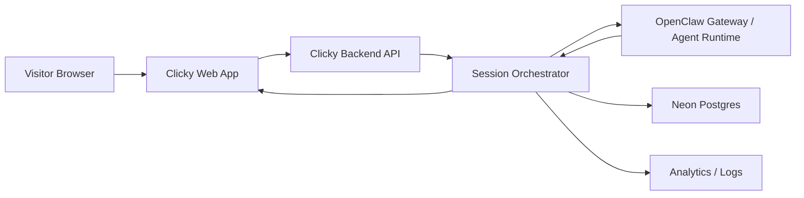

# Clicky Website Companion: OpenClaw Session Architecture

Status: partially implemented architecture

Implementation note:

- the backend-mediated session architecture described here now exists in code under `backend/src/web-companion/*`
- the web client uses those routes from `web/src/components/WebCompanionExperience.tsx`
- OpenClaw-backed generation plus local fallback exists
- AssemblyAI transcription and ElevenLabs playback are backend-mediated when configured
- remaining gaps are mostly around deeper verification, prompt tuning, and launch-quality QA

## Objective

Define the technical model for a website-integrated Clicky companion that uses
the production OpenClaw agent for live visitor conversations without changing
the current landing page design.

The architecture should support:

- one isolated OpenClaw thread per visitor session
- additive browser UI on top of the existing landing page
- curated section-aware context instead of unrestricted DOM access
- server-controlled prompt policy and runtime guardrails
- future opt-in voice and richer pointing behavior

## Constraints and repository context

- The current marketing site is a React + Vite app with heavily choreographed
  pinned sections and scroll-triggered motion.
- The landing page design should remain intact. Companion work must layer on
  top, not rearrange sections.
- The repo already has a Clicky/OpenClaw shell contract for desktop. The web
  experience should reuse that mental model where possible.
- `backend/` is already the planned Cloudflare Worker service for auth,
  entitlements, and launch web APIs.
- `worker/` is currently the AI secret proxy, but the website companion will use
  your own OpenClaw agent in production.

## Recommended shape

Use a backend-mediated architecture.

Do not connect the browser directly to the OpenClaw production Gateway for the
first implementation. Even though the full stack is owner-controlled, the
backend should remain the broker for:

- anonymous visitor session issuance
- throttling and abuse control
- page-context normalization
- prompt assembly
- OpenClaw thread lifecycle
- analytics and auditability
- response policy enforcement

The browser should speak only to Clicky's backend. The backend should speak to
OpenClaw.

## High-level flow



## Core components

### 1. Browser companion layer

Responsibilities:

- render the persistent Clicky companion UI
- observe section changes and meaningful visitor interactions
- maintain local UI state such as open, minimized, dismissed, voice-enabled
- send structured events to the backend
- stream structured responses from the backend
- execute allowed UI actions such as highlight, pulse, or scroll-to-section

Recommended browser modules:

- `SectionRegistry`
  Maps each landing-page section to a stable metadata bundle.
- `CompanionController`
  Owns UI state, session bootstrap, and message/event dispatch.
- `SectionObserver`
  Converts scroll and visibility changes into debounced semantic events.
- `CompanionRenderer`
  Renders nudges, chat, action chips, and highlight state.
- `ActionExecutor`
  Executes only approved response actions against registered targets.

### 2. Backend companion API

Responsibilities:

- create or resume anonymous visitor sessions
- accept browser events and user messages
- decide whether an event is agent-worthy or only analytics-worthy
- build the current session context
- create and bind OpenClaw threads
- send prompts to OpenClaw
- stream structured responses back to the browser
- enforce throttles, limits, and action policies

Recommended API namespace:

- `POST /v1/web-companion/sessions`
- `GET /v1/web-companion/sessions/:id`
- `POST /v1/web-companion/sessions/:id/events`
- `POST /v1/web-companion/sessions/:id/messages`
- `GET /v1/web-companion/sessions/:id/stream`
- `POST /v1/web-companion/sessions/:id/end`

### 3. Session orchestrator

This is the key backend module.

Responsibilities:

- map `visitorId -> active companion session`
- map `companionSessionId -> openclawThreadId`
- batch or debounce low-value browser events
- maintain short session summaries
- decide when to invoke OpenClaw
- transform OpenClaw outputs into the website response contract

### 4. OpenClaw adapter

Responsibilities:

- create or resume OpenClaw threads
- send the current shell context plus user/event prompt
- receive structured model responses
- translate OpenClaw thread ids and run ids into Clicky session state

The adapter should be the only backend layer that knows transport details of
the production OpenClaw Gateway.

### 5. Section content registry

This is a required design constraint, not a nice-to-have.

Each landing page section should have a curated data record containing:

- `sectionId`
- `title`
- `shortSummary`
- `approvedClaims`
- `disallowedClaims`
- `allowedTargets`
- `ctaTargets`
- `companionGoals`
- `suggestedQuestions`
- `fallbackReplyHints`

The agent should receive this registry-derived context, not raw DOM snapshots.

## Session model

### Identity layers

- `visitorId`
  Anonymous browser-level identifier stored in cookie or local storage.
- `companionSessionId`
  One browsing-journey session for the current visit window.
- `openclawThreadId`
  One production OpenClaw thread bound to that companion session.

### Recommended lifecycle

1. Visitor loads the site.
2. Browser requests session bootstrap.
3. Backend returns or creates:
   - `visitorId`
   - `companionSessionId`
   - session policy flags
   - initial companion configuration
4. Browser begins sending debounced page-context events.
5. Backend creates an OpenClaw thread lazily on first meaningful trigger.
6. Backend binds `companionSessionId` to `openclawThreadId`.
7. User messages and high-signal events reuse that thread.
8. Session expires after idle timeout or explicit end.
9. Recent summaries may be retained for short-term resume.

### Recommended time windows

- `visitorId` lifetime: 30 days
- active session idle timeout: 30 minutes
- short-term resume window: 24 hours
- long-term anonymous transcript retention: minimize and configure explicitly

This keeps the experience helpful without creating a creepy long-memory
marketing session.

## Why one thread per visitor session

This is the correct unit because it matches both product behavior and technical
isolation.

- It preserves conversational context within a single visit.
- It isolates concurrent visitors by default.
- It gives analytics a clean unit of engagement.
- It makes rate limiting and lifecycle management straightforward.
- It lets returning visitors resume briefly without turning anonymous browsing
  into durable identity tracking.

## Event model

The browser should never send raw scroll spam upstream. It should send semantic,
debounced events.

Recommended event types:

- `page_loaded`
- `section_entered`
- `section_dwell_checkpoint`
- `section_exited`
- `cta_hovered`
- `cta_clicked`
- `companion_opened`
- `companion_closed`
- `proactive_nudge_dismissed`
- `voice_enabled`
- `voice_disabled`
- `user_message_sent`
- `suggested_reply_clicked`
- `download_intent_started`

Recommended event payload fields:

- `sessionId`
- `visitorId`
- `path`
- `sectionId`
- `sectionProgress`
- `visitedSectionIds`
- `dwellMs`
- `ctaId`
- `messageText` when applicable
- `deviceClass`
- `referrerSource`
- `timestamp`

## Triggering rules

Not every event should wake the agent.

Recommended rule:

- all events are recorded
- only high-value events are considered for agent generation
- the backend applies a policy gate before calling OpenClaw

Examples of agent-worthy triggers:

- companion opened
- user message sent
- first long dwell on a high-value section
- first pricing section visit after prior feature browsing
- CTA hover after a meaningful session

Examples of analytics-only triggers:

- fast section pass-through
- repeated scroll oscillation
- duplicate dwell pings within a cool-down window

## Response contract

OpenClaw should not return raw UI commands. It should return structured website
actions inside a narrow schema.

Recommended response shape:

```json
{
  "mode": "nudge",
  "text": "Want me to explain what Clicky is doing in this section?",
  "suggestedReplies": [
    "What am I looking at?",
    "How is this different from a chatbot?"
  ],
  "actions": [
    {
      "type": "highlight",
      "targetId": "hero-download-cta"
    }
  ],
  "voice": {
    "shouldSpeak": false
  }
}
```

Allowed action types for phase one:

- `highlight`
- `pulse`
- `scroll_to_section`
- `open_companion`
- `suggest_replies`

Disallowed action types for phase one:

- arbitrary DOM selection
- arbitrary JavaScript execution
- form submission
- external navigation without explicit user click

If browser voice is enabled later, audio playback should still require a prior
user gesture so the companion stays compatible with browser autoplay rules.

## Prompt assembly model

The backend should compose prompts from stable blocks:

1. Shell identity block
   Defines Clicky as the website shell for the OpenClaw agent.

2. Policy block
   Defines allowed claims, prohibited claims, tone, and action schema.

3. Session summary block
   Summarizes recent conversation and browsing context.

4. Current page-context block
   Includes current section, nearby sections, allowed targets, and CTA state.

5. Trigger block
   Describes the user message or the proactive trigger event.

This makes prompts inspectable and testable.

## Website shell contract

The existing desktop shell contract should be extended conceptually, not
replaced.

Recommended website shell identity fields:

- `surface`: `web`
- `surfaceId`: `landing_page`
- `shellId`: `web:{companionSessionId}`
- `runtimeMode`: `web_production`
- `capabilities`:
  - `page_context`
  - `text_reply`
  - `element_highlight`
  - `scroll_guidance`
  - `optional_tts`
- `personaScope`
- `clickyPresentationName`
- `upstreamAgentIdentityName`

This keeps the website and desktop products aligned under one Clicky shell
thesis.

## OpenClaw integration recommendation

Use one of these two shapes:

### Preferred near-term shape

Extend the existing `clicky-shell` plugin concept to support a `web` surface in
addition to desktop.

Why:

- keeps Clicky as one shell family
- preserves shared identity and capability language
- avoids inventing a disconnected marketing-only integration model

### Acceptable fallback

Create a separate `clicky-web-shell` adapter if the existing plugin would become
too desktop-specific too quickly.

Decision rule:

- if the plugin can stay centered on shell capabilities, extend it
- if it becomes awkwardly split between browser and desktop mechanics, separate
  the transport adapters but keep the same shell vocabulary

## Data model

Recommended new backend tables:

### `web_visitor`

- `id`
- `anonymous_cookie_id`
- `user_id` nullable
- `first_seen_at`
- `last_seen_at`
- `user_agent_hash`
- `locale`
- `referrer_source`

### `web_companion_session`

- `id`
- `visitor_id`
- `openclaw_thread_id`
- `path`
- `entry_section_id`
- `current_section_id`
- `status`
- `started_at`
- `last_active_at`
- `ended_at`
- `metadata`

### `web_companion_event`

- `id`
- `session_id`
- `event_type`
- `section_id`
- `payload`
- `created_at`

### `web_companion_turn`

- `id`
- `session_id`
- `role`
- `trigger_type`
- `text`
- `actions`
- `latency_ms`
- `created_at`

### `web_companion_summary`

- `session_id`
- `summary_text`
- `updated_at`

The summary table is optional but useful for keeping prompts compact.

## Transport recommendation

### Phase one

- Browser to backend:
  - `POST` for bootstrap, events, and messages
  - `SSE` for streamed assistant replies
- Backend to OpenClaw:
  - server-side Gateway client or server-side HTTP integration

Why this is enough:

- simpler operationally
- easier to debug
- good fit for text-first interactions
- preserves a clean escape hatch to richer realtime later

### Phase two or later

If voice streaming or higher-frequency bidirectional interaction becomes core,
introduce a session-scoped realtime coordinator. On Cloudflare, that can become
either:

- a Durable Object per active session, or
- a dedicated realtime service if the runtime requires it

Do not start there unless phase one proves the product value.

## Rate limiting and guardrails

Backend policy should enforce:

- max proactive turn frequency per section
- session-level max automated turns without user reply
- daily per-visitor turn budget
- per-IP abuse thresholds
- strict validation of `targetId` against the section registry
- strict validation of response schema before returning to browser

Suggested starting rules:

- max 1 proactive nudge per section visit
- no proactive nudges while the user is typing
- no proactive nudges for 2 minutes after dismissal
- no more than 3 consecutive assistant-only turns

## Failure behavior

If OpenClaw fails or times out:

- keep the page fully usable
- show a graceful fallback line in the companion
- stop proactive turns for the rest of the session or until manual reopen
- log the failure with session correlation ids

The companion must fail soft, never hard.

## Observability

Track:

- session bootstrap success rate
- OpenClaw thread creation rate
- turn latency
- failure rate by section trigger
- proactive nudge acceptance rate
- highlight action usage
- assisted-to-download conversion

Log with correlation ids:

- `visitorId`
- `companionSessionId`
- `openclawThreadId`
- `openclawRunId` when available

## Security and privacy posture

- Anonymous browsing should not require auth.
- Do not leak production OpenClaw credentials or Gateway details to the browser.
- Do not store more session history than needed for the experience and metrics.
- Do not let the agent inspect arbitrary browser internals.
- Keep action execution allow-listed and target-based.

## Implementation sequence

1. Define the section registry and action target registry.
2. Add browser companion shell UI without changing current section layout.
3. Add backend session bootstrap and event ingestion.
4. Add server-side OpenClaw thread creation and message brokering.
5. Add structured response schema and browser action executor.
6. Add proactive trigger policy.
7. Add analytics, throttles, and failure handling.
8. Add opt-in voice only after the text-first flow is stable.

## Key recommendation summary

- Preserve the current landing page and layer the companion on top.
- Give every visitor one isolated companion session and one OpenClaw thread.
- Keep the browser dumb about OpenClaw internals and smart about UI state.
- Keep the backend in charge of session orchestration and policy.
- Feed the agent curated section context, not raw DOM noise.
- Reuse the Clicky shell mental model so web and desktop feel like one product.
